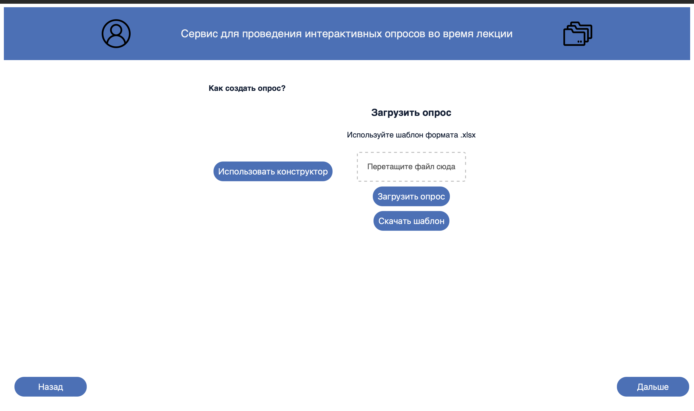
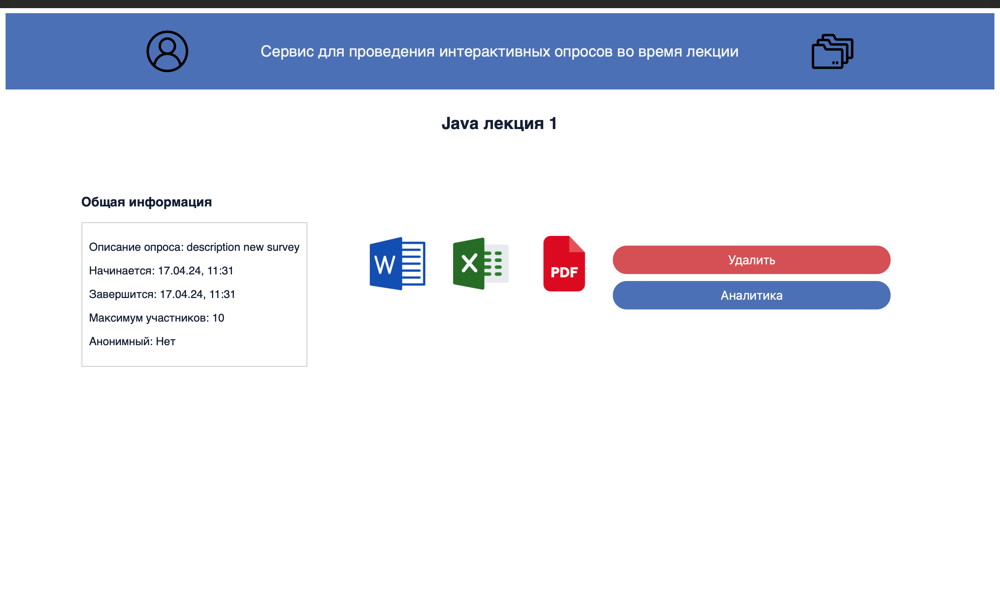
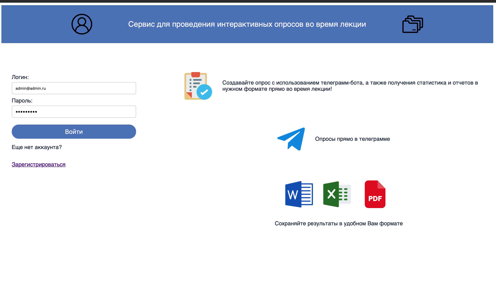
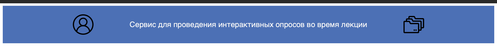
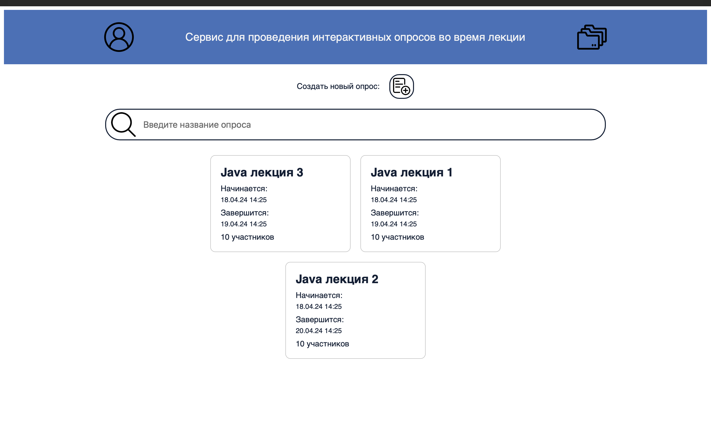
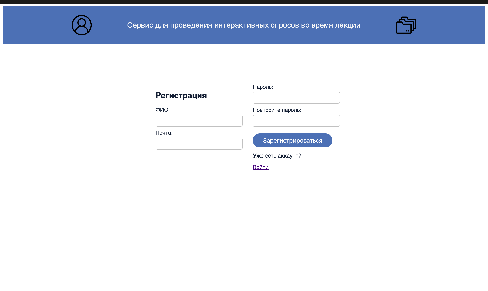
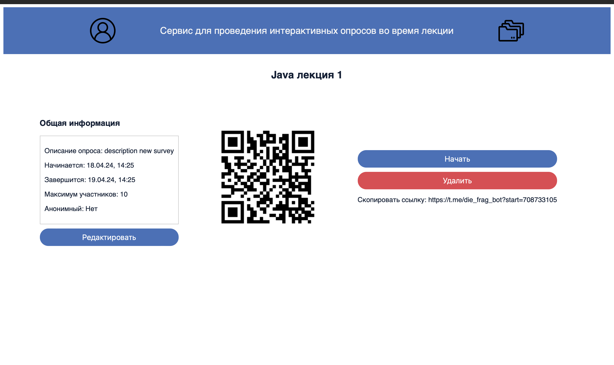
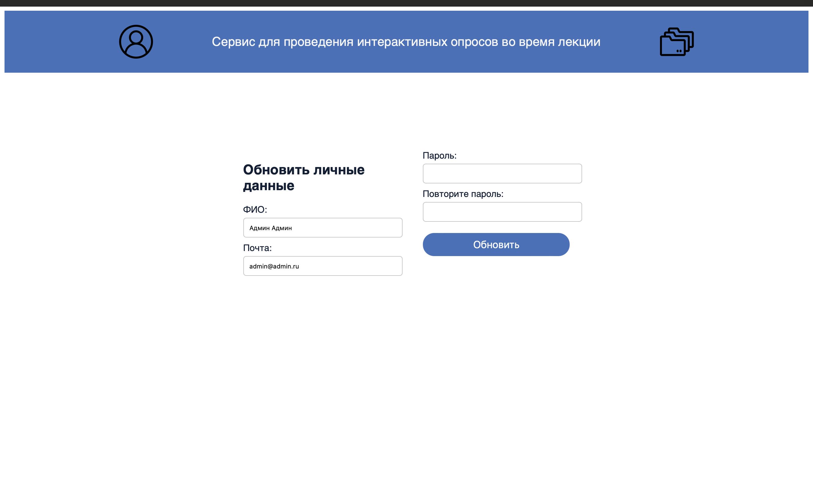

# Проект "Die Frage"

## 1. Архитектура проекта
Angular - это популярный фреймворк для разработки веб-приложений, основанный на TypeScript. Он предоставляет инструменты для создания масштабируемых и поддерживаемых приложений с помощью модульной архитектуры.  
Проект использует SPA (Single Page Application) архитектуру, что позволяет создать более быстродействующее и отзывчивое приложение для пользователей.

## 2. Структура проекта

### Папка entities
Здесь собраны все Data Transfer Objects (DTO) для запросов к бэкенду.

### Папка routing
Содержит authGuard, который запрещает переход по маршрутам без авторизации пользователя.

### Папка services
В этой папке находятся сервисы, взаимодействующие с бэкендом. Проект использует сервисы для работы с API проекта "Die Frage" (ссылка на проект: [die-frage-api](https://github.com/die-frage/die-frage-api-v2.git)).

### Модуль для авторизации auth
Здесь реализованы сервисы для сохранения jwt токена во временное хранилище браузера и механизм, добавляющий к каждому запросу jwt токена.

### Папка components
Содержит следующие компоненты:

1. **add-survey-page**: Страница добавления нового опроса.
   
2. **analyse-survey-page**: Страница для просмотра результатов опроса.
   
3. **auth-page**: Страница авторизации.
   
4. **edit-survey-page**: Страница для редактирования созданного опроса.
   
5. **header**: Шапка сайта. Реализованы две версии: одна для авторизированного пользователя, другая для не авторизированного.
   
6. **home-page**: Страница, содержащая поисковик созданных опросов и список всех опросов пользователя.
   
7. **register-page**: Страница регистрации пользователя.
   
8. **survey-page**: Страница опроса, показывающая параметры опроса, ссылку, QR-код, а также возможность скачать результаты опроса.
   
9. **user-page**: Страница редактирования личных данных пользователя: имя, фамилия, пароль, почта.
   

## Запуск проекта

Проект запускается с помощью команды из корневой директории проекта:

```bash
ng serve
```

После запуска проект доступ к приложению осуществляется через браузер по ссылке:

[http://localhost:4200/](http://localhost:4200/)

## Используемые технологии

Проект "Die Frage" разработан с использованием следующих технологий:


